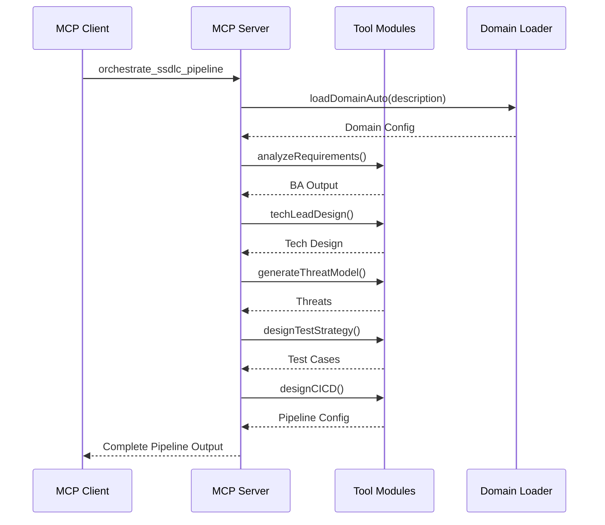

# System Architecture

This document describes the architecture of the MCP SSDLC Security Toolkit.

## Overview

The toolkit is built as a **Model Context Protocol (MCP) server** that provides AI assistants with specialized tools for secure software development lifecycle planning.

```
┌─────────────────────────────────────────────────────────────────┐
│                      MCP Client Layer                           │
│  (Claude Desktop / VS Code / Cursor / Custom MCP Clients)       │
└─────────────────────────────────────────────────────────────────┘
                              │
                              │ stdio (JSON-RPC)
                              ▼
┌─────────────────────────────────────────────────────────────────┐
│                       MCP Server                                │
│  ┌───────────────────────────────────────────────────────────┐  │
│  │                    Tool Registry                          │  │
│  │  • list_domains      • ba_analyze_requirements            │  │
│  │  • load_domain       • techlead_design                    │  │
│  │  • detect_domain     • security_threat_model              │  │
│  │                      • qa_design_test_strategy            │  │
│  │                      • devops_design_cicd                 │  │
│  │                      • orchestrate_ssdlc_pipeline         │  │
│  └───────────────────────────────────────────────────────────┘  │
└─────────────────────────────────────────────────────────────────┘
                              │
          ┌───────────────────┼───────────────────┐
          ▼                   ▼                   ▼
┌─────────────────┐   ┌─────────────────┐   ┌─────────────────┐
│  Domain Loader  │   │  Tool Modules   │   │   Exporters     │
├─────────────────┤   ├─────────────────┤   ├─────────────────┤
│ • healthcare    │   │ • ba/           │   │ • JSON          │
│ • fintech       │   │ • tech-lead/    │   │ • YAML          │
│ • blockchain    │   │ • security/     │   │ • Markdown      │
│ • secure_comm   │   │ • qa/           │   │ • SRS Document  │
│ • custom/...    │   │ • devops/       │   │                 │
│                 │   │ • architecture/ │   │                 │
└─────────────────┘   └─────────────────┘   └─────────────────┘
```

## Component Details

### 1. MCP Server (`src/index.ts`)

The entry point that:
- Creates the MCP server instance
- Registers available tools
- Handles tool call requests
- Returns results via stdio transport

### 2. Domain System (`src/domains/`)

Plugin-based domain loader supporting:
- **Built-in domains**: healthcare, fintech, blockchain, etc.
- **Custom domains**: User-defined YAML configurations
- **Auto-detection**: Keyword-based domain inference

#### Domain Structure
```
domains/
├── healthcare/
│   ├── domain.yaml      # Core domain definition
│   ├── compliance.yaml  # HIPAA requirements
│   └── threats.yaml     # Healthcare-specific threats
├── fintech/
│   ├── domain.yaml
│   ├── compliance.yaml  # PCI-DSS requirements
│   └── threats.yaml
└── custom/
    └── <your-domain>/
```

### 3. Tool Modules (`src/tools/`)

| Module | Purpose | Key Functions |
|--------|---------|---------------|
| `ba/` | Business Analysis | `analyzeRequirements()` |
| `tech-lead/` | Technical Design | `techLeadDesign()` |
| `security/` | Threat Modeling | `generateThreatModel()` |
| `qa/` | Test Strategy | `designTestStrategy()` |
| `devops/` | CI/CD Design | `designCICD()` |
| `architecture/` | ADR Generation | `generateADRs()` |
| `bm/` | Project Management | `generateProjectPlan()` |

### 4. Orchestrator (`src/orchestrator/`)

Coordinates the full SSDLC pipeline:

```
Domain Detection → BA → Tech Lead → Security → QA → DevOps → PM → ADRs
```

### 5. Exporters (`src/exporters/`)

Output formatting:
- **JSON/YAML**: Structured data export
- **Markdown**: Human-readable documents
- **SRS**: Professional specification documents

## Data Flow



## Type System

The toolkit uses TypeScript with strict typing:

```
src/types/
├── domain.ts      # Domain-related types
├── tech-lead.ts   # Tech lead output types
├── tools.ts       # Tool input/output types
├── export.ts      # Export format types
└── index.ts       # Re-exports
```

## Security Considerations

1. **No External Network**: Runs entirely locally
2. **Read-Only Domains**: Domain files are not modified
3. **Sandboxed Execution**: No file system mutations
4. **Input Validation**: Zod schema validation
5. **Non-root Docker**: Runs as unprivileged user in containers

## Extensibility

### Adding New Tools

1. Create module in `src/tools/<tool-name>/`
2. Export main function from `index.ts`
3. Register in `src/index.ts` tool list
4. Add handler in switch statement

### Adding New Domains

1. Create folder in `domains/custom/<domain>/`
2. Add required `domain.yaml`
3. Optionally add `compliance.yaml` and `threats.yaml`
4. Restart server

### Adding New Export Formats

1. Add function in `src/exporters/`
2. Export from `src/exporters/index.ts`
3. Use in tools or orchestrator
